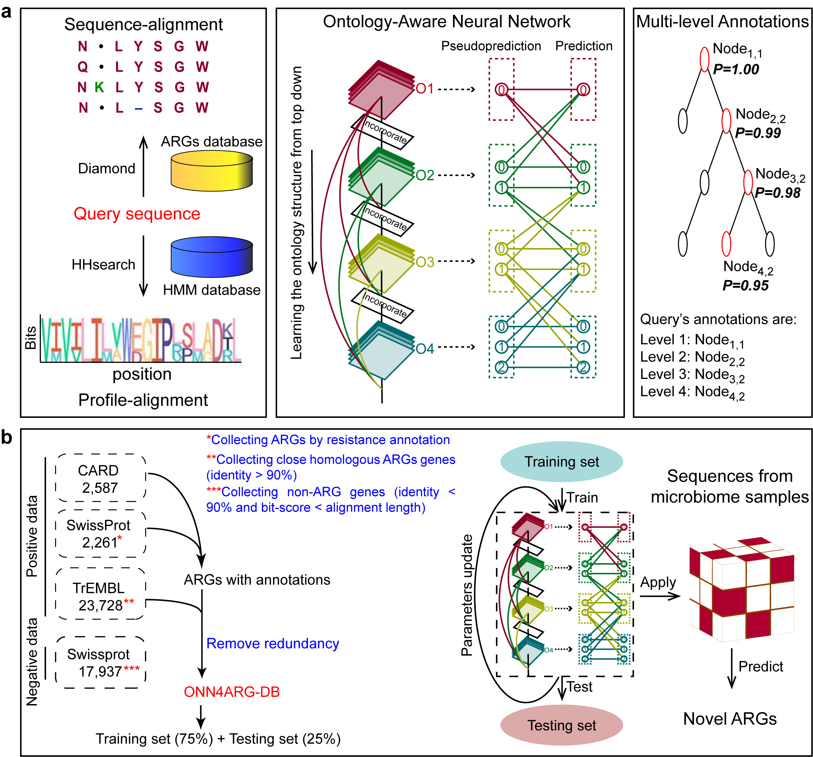

# ONN4ARG
[ONN4ARG](http://onn4arg.xfcui.com/) is an Ontology-aware Neural Network model for Antibiotic Resistance Gene (ARG) annotation predictions. It employs a novel ontology-aware layer to encourage annotation predictions satisfying the ontology rules (i.e., the ontology tree structure). It requires the [Diamond](https://github.com/bbuchfink/diamond) and the [HHblits](https://github.com/soedinglab/hh-suite) alignment tools to run. Our source codes are available on [GitHub](https://github.com/xfcui/onn4arg), and our pre-built ARG database and our pre-trained model can be downloaded from [Zenodo](https://zenodo.org/record/4973684).


## Database and ontology introduction

## Requirements

- Unix/Linux operating system

- At least 1 GB free disk space
- At least 8 GB RAM

## Dependency
- Pytorch
- NumPy
- tqdm

## Installation
We recommend deploying ONN4ARG using `git` and `conda`.

```shell
# clone this repository
git clone https://github.com/HUST-NingKang-Lab/ONN4ARG.git

```

## Usage:

./predict.sh FASTA_fileprefix

The program will take "FASTA_fileprefix.fasta" as input and store the predicted annotations in "FASTA_fileprefix.out".


## Developers

   Name   |      Email      |      Affiliation
:--------:|-----------------|----------------------------------------------------------------------------------------
Yuguo Zha |hugozha@hust.deu.cn| School of Life Science and Technology, Huazhong University of Science & Technology
Cheng Chen |chencheng3123@163.com| School of Computer Science, Shandong University
Qihong Jiao |qhjiao@mail.sdu.edu.cn| School of Computer Science, Shandong University
Xiaomei Zeng |hugozha@hust.deu.cn| School of Life Science and Technology, Huazhong University of Science & Technology
Xuefeng Cui |xfcui@email.sdu.edu.cn| School of Computer Science, Shandong University
Kang Ning |ningkang@hust.edu.cn| School of Life Science and Technology, Huazhong University of Science & Technology
## Reference
Yuguo Zha, Cheng Chen, Qihong Jiao, Xiaomei Zeng, Xuefeng Cui, Kang Ning, Ontology-Aware Deep Learning Enables Novel Antibiotic Resistance Gene Discovery Towards Comprehensive Profiling of ARGs, bioRxiv 2021.07.30.454403 (2021)[(download the PDF file)](https://doi.org/10.1101/2021.07.30.454403)
