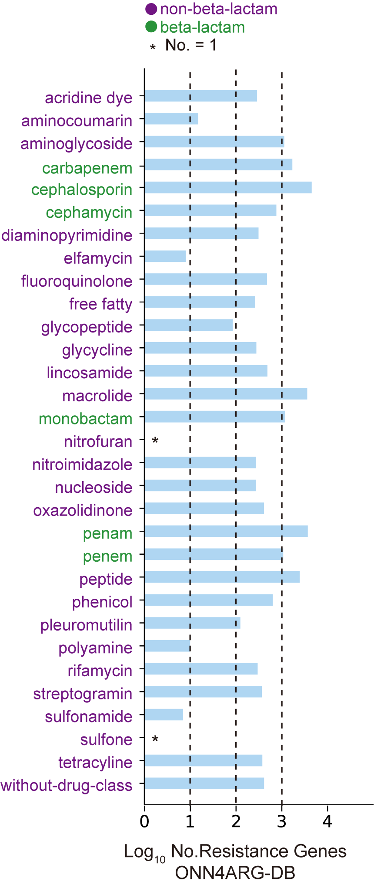

# ONN4ARG
[ONN4ARG](http://onn4arg.xfcui.com/) is an Ontology-aware Neural Network model for Antibiotic Resistance Gene (ARG) annotation predictions. It employs a novel ontology-aware layer to encourage annotation predictions satisfying the ontology rules (i.e., the ontology tree structure). It requires the [Diamond](https://github.com/bbuchfink/diamond) and the [HHblits](https://github.com/soedinglab/hh-suite) alignment tools to run. Our source codes are available on [GitHub](https://github.com/xfcui/onn4arg), and our pre-built ARG database and our pre-trained model can be downloaded from [Zenodo](https://zenodo.org/record/4973684).


Overview of the ONN4ARG model and its use for novel ARG discovery. a. The input (left), architecture (middle), and output (right) of the ONN4ARG model. ONN4ARG takes similarities between the query gene sequence and ARG gene sequences and profiles as inputs. Then, ontology-aware layers (i.e., O1, O2, O3, and O4) are employed to incorporate ancestor and descendant annotations to enhance annotation accuracy. ONN4ARG outputs multi-level annotations of antibiotic resistance types, which are compatible with the antibiotic resistance ontology structure. b. Building the dataset for training and testing and applying it on microbiome sequencing data to discover novel ARGs.

## Database
The ARGs we used in this study for model training and testing were from the Comprehensive Antibiotic Resistance Database (CARD, v3.0.3). We also used protein sequences from the UniProt (SwissProt and TrEMBL) database to expand our training dataset. First, genes with ARG annotations were collected from CARD (2,587 ARGs) and SwissProt (2,261 ARGs). Then, their close homologs (with sequence identities greater than 90%) were collected from TrEMBL (23,728 homologous genes). These annotated and homologous ARGs made up our positive dataset. The negative dataset was made from non-ARG genes that had relatively weak sequence similarities to ARG genes (with sequence identities smaller than 90% and bit-scores smaller than alignment lengths) but not annotated as ARG genes in SwissProt (17,937 genes). Finally, redundant genes with identical sequences were filtered out. As a result, our ARG gene dataset, namely, ONN4ARG-DB, contained 28,396 positive and 17,937 negative genes. For evaluation and comparison of ONN4ARG, 75% of the dataset was randomly selected for training, and the remaining 25% of the dataset was selected for testing.


The number of genes in ONN4ARG-DB. The horizontal axis indicates the logarithmic number of genes, and the vertical axis indicates different antibiotic resistance types.

## Ontology
The antibiotic resistance ontology was organized into an ontology structure, which contains four levels. The root (first level) is a single node, namely, “arg”. There are 1, 2, 34, and 277 nodes from the first level to the fourth level, respectively. For instance, there are “beta-lactam” and “non-beta-lactam” in the second level, “acridine dye” and “aminocoumarin” in the third level, and “acriflavine” and “clorobiocin” in the fourth level. For example, AHE40557.1 is annotated in the CARD database as a streptomycin resistance gene, which belongs to a lower-level ARG type aminoglycoside and a higher-level ARG type non-beta-lactam.

## Requirements

- Unix/Linux operating system

- At least 1 GB free disk space
- At least 8 GB RAM

## Dependency
- Pytorch
- NumPy
- tqdm

## Installation
We recommend deploying ONN4ARG using `git` and `conda`.

```shell
# clone this repository
git clone https://github.com/HUST-NingKang-Lab/ONN4ARG.git

```

## Usage:

./predict.sh FASTA_fileprefix

The program will take "FASTA_fileprefix.fasta" as input and store the predicted annotations in "FASTA_fileprefix.out".


## Developers

   Name   |      Email      |      Affiliation
----------|-----------------|----------------------------------------------------------------------------------------
Yuguo Zha |hugozha@hust.edu.cn| School of Life Science and Technology, Huazhong University of Science & Technology
Cheng Chen |chencheng3123@163.com| School of Computer Science, Shandong University
Qihong Jiao |qhjiao@mail.sdu.edu.cn| School of Computer Science, Shandong University
Xiaomei Zeng |xmzeng@hust.edu.cn| School of Life Science and Technology, Huazhong University of Science & Technology
Xuefeng Cui |xfcui@email.sdu.edu.cn| School of Computer Science, Shandong University
Kang Ning |ningkang@hust.edu.cn| School of Life Science and Technology, Huazhong University of Science & Technology
## Reference
Yuguo Zha, Cheng Chen, Qihong Jiao, Xiaomei Zeng, Xuefeng Cui, Kang Ning, Ontology-Aware Deep Learning Enables Novel Antibiotic Resistance Gene Discovery Towards Comprehensive Profiling of ARGs, bioRxiv 2021.07.30.454403 (2021) [(download the PDF file)](https://doi.org/10.1101/2021.07.30.454403)
